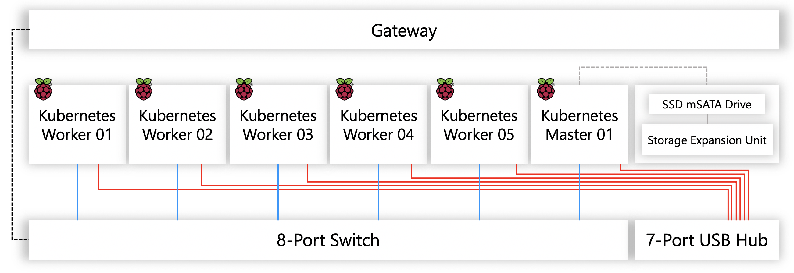
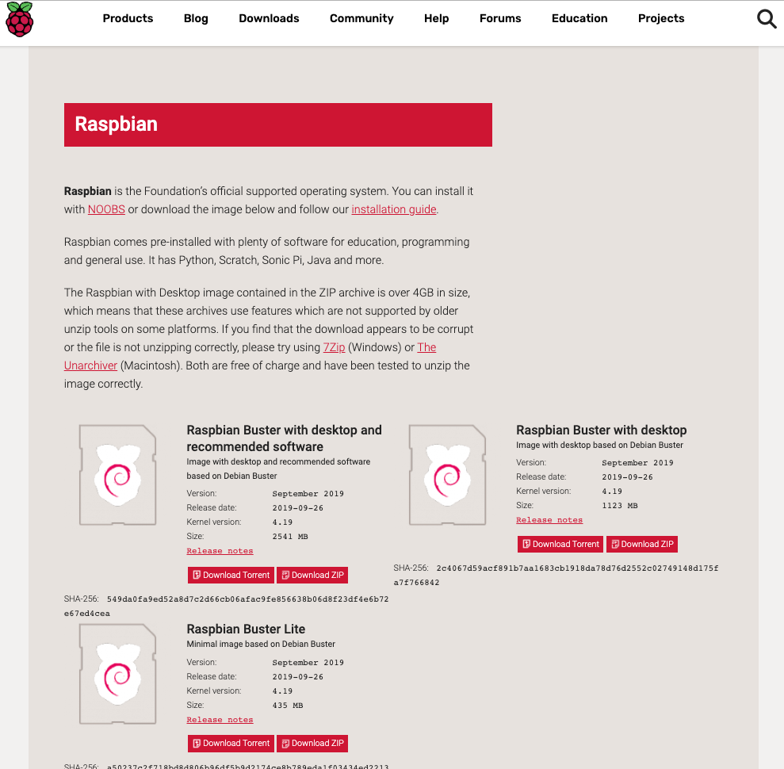
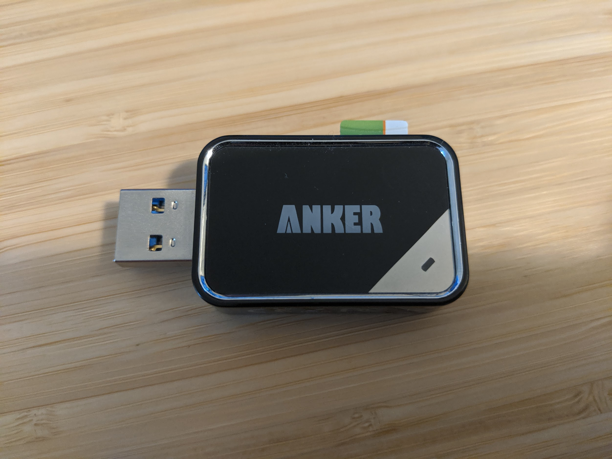
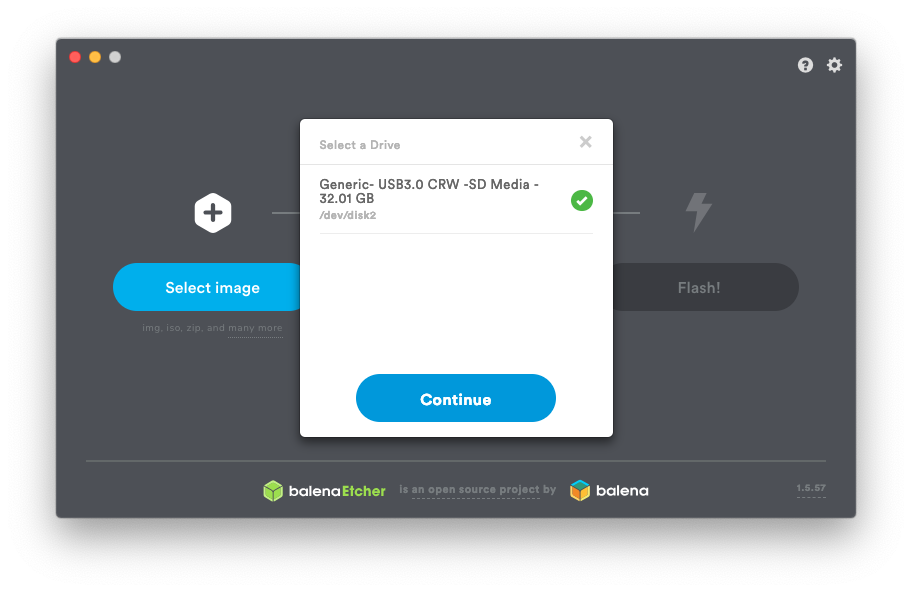
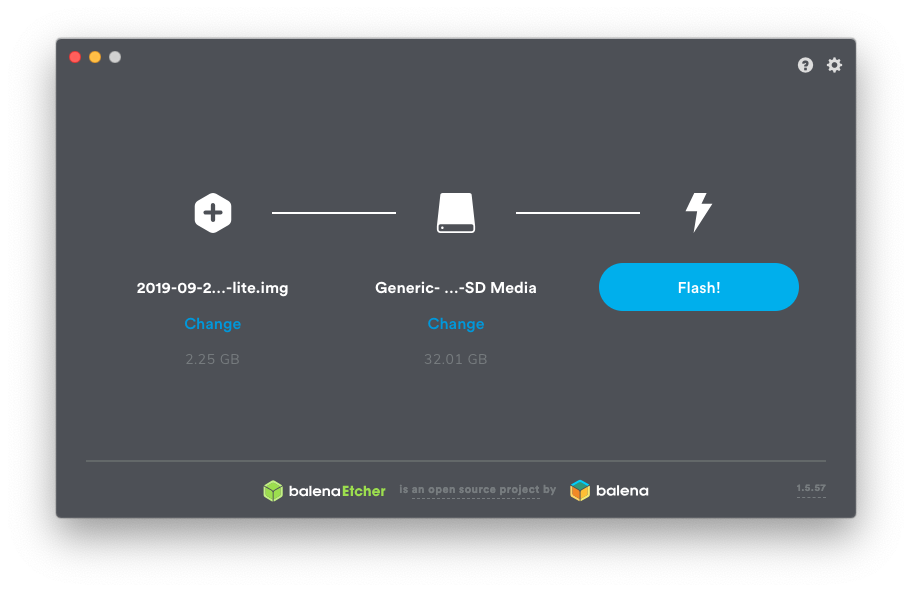
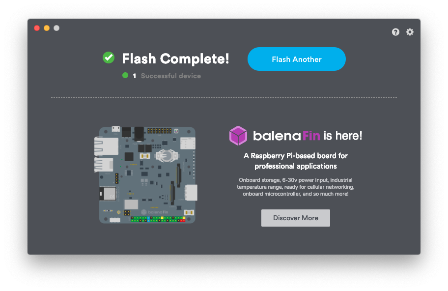
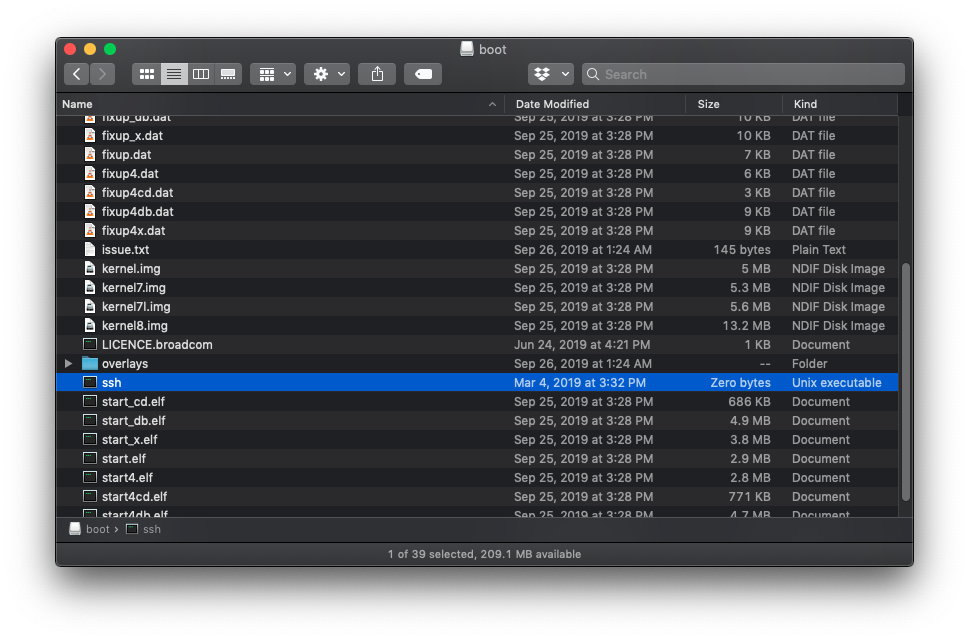

# ARMadillo

"ARMadillo" is a "pet project", created to provide a way to deploy Kubernetes cluster on Raspberry Pi in both a single and a multi-master topologies, all using simple bash scripts and leveraging the native capabilities of the [kubeadm project](https://kubernetes.io/docs/reference/setup-tools/kubeadm/kubeadm/).

This repo provide the software stack of ARMadillo. For an overview of the hardware stack and the build out process, please visit the [ARMadillo](http://thewalkingdevs.io/tag/armadillo/) page on my personal blog.

## Architecture
### ARMadillo Kubernetes Multi-Master Deployment Hardware Architecture


### ARMadillo Kubernetes Single Master Deployment Hardware Architecture


## Perquisites
### Preparing the Pi's

1. Download the Raspbian OS zip image. ARMadillo was tested working on both [raspbian stretch](https://downloads.raspberrypi.org/raspbian/images/raspbian-2019-04-09/) and [raspbian buster lite](https://www.raspberrypi.org/downloads/raspbian/).




2. The LAN the Pi's are connected to needs to be DHCP-enabled. 

3. Flashing the Pi and the deploy Raspbian is easy. First, download and install [balenaEtcer](https://www.balena.io/etcher/?ref=etcher_footer).
    -   Insert SD card to your SD card reader.
    -   Select the Raspbian zip file you've just downloaded.
    -   Select the SD card and hit the "Flash!".
    -   Once flashing is done, re-insert the SD card to your SD card reader (as balenaEtcer will unmount the SD card)
    -   Create *ssh* file and copy it to the */boot* partition. This is required to be able ssh the Pi. 
    -   Insert the card back to the Pi and power it on.
    -   Repeat these steps for each Pi in your cluster.  










### Edit the *env_vars* file

4. Fork this repo :-)

5. The env_vars.sh file is the most important file as it will the determine the environment variables for either the single or multi-master deployment. Based on your deployment, edit the *env_vars.sh* file, commit & push the changes to your forked ARMadillo repo.

* For multi-master deployment, edit the ```ARMadillo/deploy/multi_master/env_vars.sh``` file.
* For single master deployment, edit the ```ARMadillo/deploy/single_master/env_vars.sh``` file.

**Note: ARMadillo deployment scripts [source](https://linuxize.com/post/bash-source-command/) the _env_vars_ file arguments upon execution. The _env_vars_ edit is a one-time edit.**

6. To make things a lot easier for you, edit your local hosts file where you will connect to the PI's from and add the HAProxy, masters and workers nodes hostname/IP based on the changes you just made to the *env_vars* file. 

## ARMadillo k8s Multi-Master Deployment
### Clone the repo

**Note: For multi master deployment, ARMadillo supports more then 3 master and more/less then 2 worker nodes. To add more master nodes and add/subtract worker nodes, simply edit these in the _ARMadillo/deploy/multi_master/env_vars.sh_ file.** 

1. SSH to the masters and workers nodes using the default *raspberry* password and clone the ARMadillo github repository you've just forked.

	```sudo apt-get install git -qy && git clone https://github.com/<your github username>/ARMadillo.git```

**If you are using private github repository, a [personal access token](https://help.github.com/en/github/authenticating-to-github/creating-a-personal-access-token-for-the-command-line) is required. After generating the token, edit the _ARMadillo/scripts/git_clone_private.sh_ and use it to clone the repository.**

### Prepare HAProxy Load Balancer

2. Run the "haproxy_config_hosts.sh" script and wait for the host to restart.

	```./ARMadillo/deploy/multi_master/haproxy_config_hosts.sh```

3. From your local environment, test successful login to the HAProxy node using the new hostname/IP and the username/password you previously allocated.

### Kubernetes nodes perquisites

4. SSH to the masters and workers nodes and run the perquisites script.

**Note: This step can ~15min per node BUT it's safe run the perquisites in parallel on each master/worker**

* On MASTER01 run: ```./ARMadillo/deploy/multi_master/master01_perquisites.sh```
* On MASTER02 run: ```./ARMadillo/deploy/multi_master/master02_perquisites.sh```
* On MASTER03 run: ```./ARMadillo/deploy/multi_master/master03_perquisites.sh```
* On WORKER01 run: ```./ARMadillo/deploy/multi_master/worker01_perquisites.sh```
* On WORKER02 run: ```./ARMadillo/deploy/multi_master/worker02_perquisites.sh```

Before moving on to the next step, wait for all masters and workers nodes to restart. 

**At this point, the HAProxy and all nodes should be able to ping one another using it's respective hostname/IP.**

### Install HAProxy & generate certificates

5. On the HAProxy Pi, run the deployment and certificates generation script.

```./ARMadillo/deploy/multi_master/haproxy_install.sh```

### Initializing kubeadm to deploy the k8s cluster

6. On **MASTER01 only**, run the kubeadm initialization script. The script will:

* Create and will join the first node as *MASTER01* to k8s cluster.
* Will remotely do the same for all the master and worker nodes. 

```./ARMadillo/deploy/multi_master/master01_kubeadm_init.sh```

Once the script run has finished, the k8s cluster will be up and running.


## ARMadillo k8s Single Master Deployment
### Kubernetes nodes perquisites

1. SSH to the master and workers nodes using the default *raspberry* password and clone the ARMadillo github repository you've just forked.

	```sudo apt-get install git -qy && git clone https://github.com/<your github username>/ARMadillo.git```

2. Run the perquisites script on the master and each of the workers nodes.

**Note: This step can ~15min per node BUT it's safe run the perquisites in parallel on each master/worker**

* On MASTER01 run: ```./ARMadillo/deploy/single_master/master01_perquisites.sh```
* On WORKER01 run: ```./ARMadillo/deploy/single_master/worker01_perquisites.sh```
* On WORKER02 run: ```./ARMadillo/deploy/single_master/worker02_perquisites.sh```
* On WORKER03 run: ```./ARMadillo/deploy/single_master/worker03_perquisites.sh```
* On WORKER04 run: ```./ARMadillo/deploy/single_master/worker04_perquisites.sh```
* On WORKER05 run: ```./ARMadillo/deploy/single_master/worker05_perquisites.sh```

Before moving on to the next step, wait for all masters and workers nodes to restart. 

**At this point, all nodes should be able to ping one another using it's hostname/IP.**

### Initializing kubeadm to deploy the k8s cluster

3. On **the only master node**, run the kubeadm initialization script. The script will:

* Create and will join the first node as *MASTER01* to k8s cluster.
* Will remotely do the same for all the worker nodes. 

```./ARMadillo/deploy/single_master/master01_kubeadm_init.sh```

Once the script run has finished, the k8s cluster will be up and running.


## ARMadillo Shutdown

To gracefully shutdown a Raspberry Pi, use the ```sudo /sbin/shutdown -hP now``` command. Also included in this repo is a remote shutdown script which you can use from your local environment for both the multi and single master deployment. 

```./scripts/graceful_shudown/multi_master/graceful_shudown.sh```
```./scripts/graceful_shudown/single_master/graceful_shudown.sh```

## ARMadillo House Cleaning

To reset kubeadm and k8s cluster deployment, run the kubeadm cleanup script on each master(s) and worker(s) node. The script will reset kubeadm, delete all artifects and "trail" files, delete the old ARMadillo repo from the Pi and will eventually clone the most up-to-date ARMadillo repo.

```./ARMadillo/scripts/kubeadm_cleanup.sh```

For the cleanup script to work, you will need to execute it from the Pi _/home/pi_ directory.
